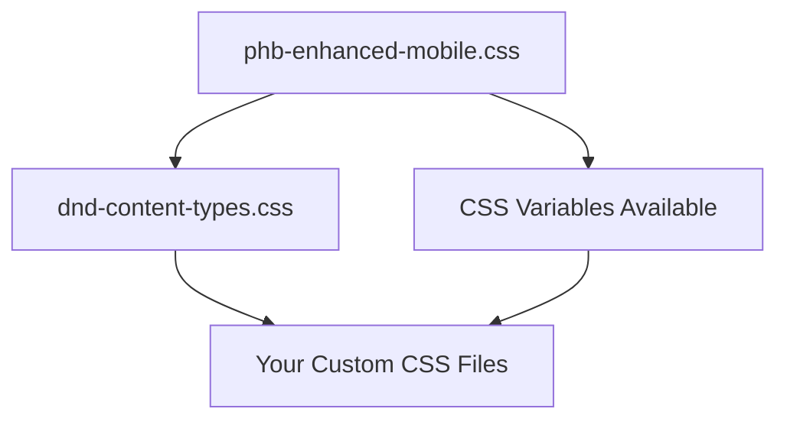

# Advanced D&D CSS Customization Tutorial 🎨

## 🏗️ Modular CSS Architecture

### **How the System Works**
```
📁 Obsidian CSS Snippets Folder/
├── 🎯 phb-enhanced-mobile.css      (Core D&D styling - 18KB)
├── 🎲 dnd-content-types.css        (Specialized blocks - 8KB)  
├── 🎨 my-campaign-colors.css       (Your color overrides - 2KB)
├── 🏰 homebrew-additions.css       (Your custom blocks - 5KB)
└── 📱 mobile-tweaks.css            (Device-specific fixes - 1KB)
```

### **Loading Order & Dependencies**


**🔑 Key Principle**: Later CSS files override earlier ones using CSS specificity!

---

## 🎨 Color Customization System

### **Understanding CSS Custom Properties**
The system uses **CSS variables** for easy theming:

```css
/* Core color variables defined in main CSS */
:root {
    --phb-burgundy: #58180D;     /* Main D&D red-brown */
    --phb-gold: #c9ad6a;        /* D&D gold accent */
    --phb-cream: #fdf1dc;       /* Parchment background */
    --phb-dark-cream: #f4e5d0;  /* Darker parchment */
    --phb-brown: #8B7562;       /* Secondary brown */
    --phb-dark-brown: #722F37;  /* Dark accent brown */
    --phb-light-gold: #e8d5a3;  /* Light gold variant */
    --phb-shadow: rgba(0, 0, 0, 0.3);
    --phb-text-shadow: rgba(255, 255, 255, 0.8);
}
```

### **Create Custom Color Schemes**

#### **Dark Campaign Theme** 🌙
```css
/* File: dark-campaign.css */
:root {
    --phb-burgundy: #2C1810 !important;    /* Darker browns */
    --phb-gold: #B8860B !important;        /* Muted gold */
    --phb-cream: #F5F5DC !important;       /* Beige instead of cream */
    --phb-brown: #654321 !important;       /* Darker brown */
    --phb-dark-brown: #8B4513 !important;  /* Saddle brown */
}

/* Override specific elements for dark theme */
.adventure-hook {
    background: linear-gradient(135deg, rgba(47, 79, 79, 0.2) 0%, rgba(25, 25, 112, 0.1) 100%) !important;
}

.treasure {
    box-shadow: 0 0 15px rgba(184, 134, 11, 0.4) !important;
}
```

#### **Ethereal/Fey Campaign** ✨
```css
/* File: fey-campaign.css */
:root {
    --phb-burgundy: #4B0082 !important;    /* Deep purple */
    --phb-gold: #DA70D6 !important;        /* Orchid */
    --phb-cream: #F0F8FF !important;       /* Alice blue */
    --phb-brown: #9370DB !important;       /* Medium purple */
    --phb-dark-brown: #8A2BE2 !important;  /* Blue violet */
}

/* Add sparkle effects */
.spell::after {
    content: "✨" !important;
    position: absolute !important;
    top: 5px !important;
    right: 5px !important;
    animation: sparkle 2s infinite !important;
}

@keyframes sparkle {
    0%, 100% { opacity: 1; transform: scale(1); }
    50% { opacity: 0.5; transform: scale(1.2); }
}
```

#### **Gritty/Military Campaign** ⚔️
```css
/* File: military-campaign.css */
:root {
    --phb-burgundy: #800000 !important;    /* Maroon */
    --phb-gold: #B87333 !important;        /* Dark goldenrod */
    --phb-cream: #F5F5F0 !important;       /* Light gray */
    --phb-brown: #A0522D !important;       /* Sienna */
    --phb-dark-brown: #8B4513 !important;  /* Saddle brown */
}

/* Military-style borders */
.encounter {
    border-style: double !important;
    border-width: 4px !important;
}

.quest-title::before {
    content: "🎖️ " !important;
}
```

---

## 🛠️ Creating Custom Content Blocks

### **Template for New Block Types**
```css
/* Custom Block Template */
.your-custom-block {
    /* Background with texture */
    background: 
        linear-gradient(135deg, rgba(255, 248, 235, 0.95) 0%, rgba(248, 238, 220, 0.95) 100%),
        radial-gradient(circle at 60% 40%, rgba(YOUR_COLOR, 0.08) 0%, transparent 50%) !important;
    
    /* Border styling */
    border: 2px solid YOUR_BORDER_COLOR !important;
    border-radius: 12px !important;
    
    /* Spacing and shadows */
    padding: 1.5em !important;
    margin: 2em 0 !important;
    box-shadow: 
        0 4px 12px rgba(0, 0, 0, 0.12),
        inset 0 1px 0 rgba(255, 255, 255, 0.8) !important;
    
    /* Positioning for decorative elements */
    position: relative !important;
}

/* Decorative icon */
.your-custom-block::before {
    content: "🎯" !important;  /* Change emoji */
    position: absolute !important;
    top: -12px !important;
    right: 1.5em !important;
    background-color: var(--phb-cream) !important;
    padding: 0 0.5em !important;
    font-size: 1.3em !important;
}

/* Title styling */
.your-custom-title {
    font-family: "Cinzel", serif !important;
    font-weight: bold !important;
    color: YOUR_TITLE_COLOR !important;
    font-size: 1.25em !important;
    margin: 0 0 1em 0 !important;
    text-align: center !important;
    text-shadow: 1px 1px 2px rgba(255, 255, 255, 0.8) !important;
}

/* Ensure text is readable */
.your-custom-block * {
    color: #000 !important;
    background-color: transparent !important;
}

/* Mobile responsiveness */
@media screen and (max-width: 768px) {
    .your-custom-block {
        padding: 1.2em !important;
        margin: 1.5em 0 !important;
    }
    
    .your-custom-title {
        font-size: 1.1em !important;
    }
}
```

### **Example: Custom Puzzle Block** 🧩
```css
/* File: puzzle-blocks.css */
.puzzle {
    background: 
        linear-gradient(135deg, rgba(255, 250, 205, 0.95) 0%, rgba(250, 240, 180, 0.95) 100%),
        radial-gradient(circle at 30% 70%, rgba(255, 140, 0, 0.08) 0%, transparent 50%) !important;
    border: 3px solid #FF8C00 !important;
    border-radius: 15px !important;
    padding: 1.5em !important;
    margin: 2em 0 !important;
    position: relative !important;
    box-shadow: 
        0 5px 15px rgba(0, 0, 0, 0.15),
        inset 0 2px 0 rgba(255, 255, 255, 0.8) !important;
}

.puzzle::before {
    content: "🧩" !important;
    position: absolute !important;
    top: -15px !important;
    left: 50% !important;
    transform: translateX(-50%) !important;
    background-color: var(--phb-cream) !important;
    padding: 0 0.6em !important;
    font-size: 1.5em !important;
    border-radius: 50% !important;
    box-shadow: 0 3px 8px rgba(0, 0, 0, 0.2) !important;
}

.puzzle-title {
    font-family: "Cinzel", serif !important;
    font-weight: bold !important;
    color: #FF8C00 !important;
    font-size: 1.3em !important;
    margin: 0 0 1.2em 0 !important;
    text-align: center !important;
    text-shadow: 1px 1px 2px rgba(255, 255, 255, 0.8) !important;
}

.puzzle-difficulty {
    display: inline-block !important;
    padding: 0.3em 0.8em !important;
    border-radius: 15px !important;
    font-size: 0.9em !important;
    font-weight: bold !important;
    margin-bottom: 1em !important;
}

.puzzle-difficulty.simple {
    background-color: #90EE90 !important;
    color: #006400 !important;
}

.puzzle-difficulty.moderate {
    background-color: #FFD700 !important;
    color: #B8860B !important;
}

.puzzle-difficulty.complex {
    background-color: #FFA500 !important;
    color: #FF4500 !important;
}

.puzzle-difficulty.legendary {
    background-color: #FF6347 !important;
    color: #8B0000 !important;
}

.puzzle * {
    color: #000 !important;
    background-color: transparent !important;
}
```

### **Usage Example:**
```html
<div class="puzzle">
<div class="puzzle-title">The Sphinx's Riddle</div>
<div class="puzzle-difficulty complex">Complex</div>
<p>"What walks on four legs at dawn, two legs at noon, and three legs at dusk?"</p>
<details>
<summary>Solution</summary>
<p>A human - crawling as a baby, walking as an adult, using a cane when elderly.</p>
</details>
</div>
```

---

## 🎭 Advanced Content Types

### **Weather & Atmosphere Block** 🌤️
```css
.weather {
    background: 
        linear-gradient(135deg, rgba(240, 248, 255, 0.95) 0%, rgba(230, 240, 250, 0.95) 100%),
        radial-gradient(circle at 40% 60%, rgba(135, 206, 235, 0.1) 0%, transparent 50%) !important;
    border: 2px solid #87CEEB !important;
    border-radius: 10px !important;
    padding: 1.3em !important;
    margin: 1.8em 0 !important;
    position: relative !important;
}

.weather::before {
    content: "🌤️" !important;
    position: absolute !important;
    top: -10px !important;
    left: 1.5em !important;
    background-color: var(--phb-cream) !important;
    padding: 0 0.4em !important;
    font-size: 1.2em !important;
}

.weather-condition {
    font-weight: bold !important;
    color: #4682B4 !important;
    font-size: 1.1em !important;
}
```

### **Social Encounter Block** 👥
```css
.social-encounter {
    background: 
        linear-gradient(135deg, rgba(255, 240, 245, 0.95) 0%, rgba(250, 230, 240, 0.95) 100%),
        radial-gradient(circle at 60% 40%, rgba(199, 21, 133, 0.08) 0%, transparent 50%) !important;
    border: 2px solid #DB7093 !important;
    border-radius: 12px !important;
    padding: 1.4em !important;
    margin: 2em 0 !important;
    position: relative !important;
}

.social-encounter::before {
    content: "🎭" !important;
    position: absolute !important;
    top: -10px !important;
    right: 1.5em !important;
    background-color: var(--phb-cream) !important;
    padding: 0 0.4em !important;
    font-size: 1.2em !important;
}

.social-dc {
    display: inline-block !important;
    padding: 0.2em 0.6em !important;
    background-color: rgba(219, 112, 147, 0.2) !important;
    border-radius: 12px !important;
    font-weight: bold !important;
    color: #8B008B !important;
    font-size: 0.9em !important;
}
```

### **Magic Zone Block** ✨
```css
.magic-zone {
    background: 
        linear-gradient(135deg, rgba(248, 248, 255, 0.95) 0%, rgba(240, 240, 255, 0.95) 100%),
        radial-gradient(circle at 50% 50%, rgba(148, 0, 211, 0.1) 0%, transparent 50%) !important;
    border: 3px solid #9400D3 !important;
    border-radius: 15px !important;
    padding: 1.5em !important;
    margin: 2em 0 !important;
    position: relative !important;
    box-shadow: 
        0 5px 15px rgba(0, 0, 0, 0.15),
        inset 0 2px 0 rgba(255, 255, 255, 0.9),
        0 0 20px rgba(148, 0, 211, 0.2) !important;
}

.magic-zone::before {
    content: "🔮" !important;
    position: absolute !important;
    top: -15px !important;
    left: 50% !important;
    transform: translateX(-50%) !important;
    background-color: var(--phb-cream) !important;
    padding: 0 0.6em !important;
    font-size: 1.5em !important;
    border-radius: 50% !important;
    animation: magical-pulse 3s ease-in-out infinite !important;
}

@keyframes magical-pulse {
    0%, 100% { 
        box-shadow: 0 0 8px rgba(148, 0, 211, 0.4);
        transform: translateX(-50%) scale(1);
    }
    50% { 
        box-shadow: 0 0 15px rgba(148, 0, 211, 0.6);
        transform: translateX(-50%) scale(1.1);
    }
}

.magic-zone-effect {
    font-style: italic !important;
    color: #4B0082 !important;
    background: rgba(148, 0, 211, 0.05) !important;
    padding: 0.5em !important;
    border-radius: 6px !important;
    border-left: 3px solid #9400D3 !important;
    margin: 0.8em 0 !important;
}
```

---

## 📱 Mobile Optimization Techniques

### **Advanced Responsive Breakpoints**
```css
/* Ultra-wide screens (4K monitors) */
@media screen and (min-width: 1920px) {
    .markdown-preview-view {
        max-width: 1400px !important;
        margin: 0 auto !important;
    }
    
    .two-column {
        columns: 3 !important; /* Three columns on very wide screens */
    }
}

/* Large tablets (iPad Pro landscape) */
@media screen and (min-width: 1024px) and (max-width: 1366px) {
    body { font-size: 16px !important; }
    
    .stat-block, .spell, .quest {
        padding: 1.8em !important;
    }
}

/* Small tablets (iPad portrait) */
@media screen and (min-width: 768px) and (max-width: 1023px) {
    .two-column {
        columns: 2 !important;
        column-gap: 1.5em !important;
    }
}

/* Large phones (iPhone Pro Max) */
@media screen and (min-width: 414px) and (max-width: 767px) {
    .drop-cap::first-letter {
        font-size: 4.5em !important;
        margin: 0.05em 0.12em 0 0 !important;
    }
}

/* Small phones (iPhone SE) */
@media screen and (max-width: 413px) {
    body { font-size: 14px !important; }
    
    h1 { font-size: 1.6em !important; }
    h2 { font-size: 1.3em !important; }
    
    .adventure-hook, .quest, .encounter {
        padding: 0.8em !important;
        margin: 1em 0 !important;
    }
}
```

### **Touch-Optimized Interactive Elements**
```css
/* Larger touch targets */
.clickable-element {
    min-height: 44px !important;
    min-width: 44px !important;
    touch-action: manipulation !important;
}

/* Prevent text selection on decorative elements */
.adventure-hook::before,
.quest::before,
.encounter::before {
    user-select: none !important;
    -webkit-user-select: none !important;
    pointer-events: none !important;
}

/* Smooth scrolling performance */
.markdown-preview-view {
    -webkit-overflow-scrolling: touch !important;
    scroll-behavior: smooth !important;
}

/* Reduce animations on low-power devices */
@media (prefers-reduced-motion: reduce) {
    * {
        animation-duration: 0.01ms !important;
        animation-iteration-count: 1 !important;
        transition-duration: 0.01ms !important;
    }
}
```

---

## 🖨️ Advanced Print Customization

### **Professional Print Layouts**
```css
@media print {
    /* Book-style margins */
    @page {
        margin: 0.75in 1in !important;
        background: var(--phb-cream) !important;
    }
    
    /* Left and right page margins for binding */
    @page :left {
        margin-left: 1.25in !important;
        margin-right: 0.75in !important;
    }
    
    @page :right {
        margin-left: 0.75in !important;
        margin-right: 1.25in !important;
    }
    
    /* Chapter starts on right page */
    h1 {
        page-break-before: right !important;
        break-before: recto !important;
    }
    
    /* Avoid orphans and widows */
    p {
        orphans: 3 !important;
        widows: 3 !important;
    }
    
    /* Keep stat blocks together */
    .stat-block, .spell, .feature {
        page-break-inside: avoid !important;
        break-inside: avoid !important;
    }
    
    /* Reduce file size by simplifying shadows */
    * {
        box-shadow: none !important;
        text-shadow: none !important;
    }
    
    /* High contrast for printing */
    .adventure-hook, .quest, .encounter {
        border-width: 2px !important;
        background-color: rgba(255, 255, 255, 0.8) !important;
    }
}

/* Print-specific classes */
.print-page-break {
    page-break-before: always !important;
    break-before: page !important;
}

.print-column-break {
    break-after: column !important;
    page-break-after: avoid !important;
}

.print-keep-together {
    page-break-inside: avoid !important;
    break-inside: avoid !important;
}
```

### **PDF Export Optimization**
```css
/* Optimize for PDF generation */
@media print {
    /* Ensure backgrounds render in PDF */
    * {
        -webkit-print-color-adjust: exact !important;
        print-color-adjust: exact !important;
        color-adjust: exact !important;
    }
    
    /* Optimize font rendering for PDF */
    body {
        text-rendering: geometricPrecision !important;
        -webkit-font-smoothing: subpixel-antialiased !important;
    }
    
    /* Remove interactive elements from print */
    .no-print,
    [onclick],
    button {
        display: none !important;
    }
}
```

---

## 🔧 Performance Optimization

### **CSS Performance Best Practices**
```css
/* Use efficient selectors */
.quest-title {                    /* Good - single class */
    color: #FF8C00 !important;
}

/* Avoid expensive selectors */
div div div .quest-title {        /* Bad - deep nesting */
    color: #FF8C00 !important;
}

/* Use transform instead of changing layout properties */
.hover-effect:hover {
    transform: scale(1.05) !important;    /* Good - GPU accelerated */
    /* width: 105% !important; */         /* Bad - triggers reflow */
}

/* Optimize animations */
@keyframes efficient-fade {
    from { opacity: 0; transform: translateY(-10px); }
    to { opacity: 1; transform: translateY(0); }
}

/* Use will-change for elements that will animate */
.animated-element {
    will-change: transform, opacity !important;
}

/* Remove will-change after animation completes */
.animated-element.animation-complete {
    will-change: auto !important;
}
```

### **Memory Usage Optimization**
```css
/* Reduce gradient complexity on mobile */
@media screen and (max-width: 768px) {
    .adventure-hook,
    .quest,
    .encounter {
        background: rgba(255, 248, 235, 0.95) !important; /* Simple background */
    }
}

/* Use CSS containment for better performance */
.stat-block,
.spell,
.quest {
    contain: layout style paint !important;
}

/* Optimize large documents */
.markdown-preview-view {
    contain: strict !important; /* Isolate from rest of page */
}
```

---

## 🎨 Creating Theme Packs

### **Theme Pack Structure**
```css
/* File: cyberpunk-campaign.css */
/* Cyberpunk D&D Campaign Theme */

:root {
    /* Neon glow effects */
.adventure-hook,
.quest,
.encounter {
    box-shadow: 
        0 0 20px var(--cyber-neon-blue),
        inset 0 0 10px rgba(0, 255, 255, 0.1) !important;
    border-color: var(--cyber-neon-blue) !important;
}

/* Glitch effect for headings */
@keyframes glitch {
    0%, 100% { transform: translate(0); }
    10% { transform: translate(-2px, -1px); }
    20% { transform: translate(2px, 1px); }
    30% { transform: translate(-1px, 2px); }
    40% { transform: translate(1px, -1px); }
    50% { transform: translate(-1px, 1px); }
    60% { transform: translate(2px, -2px); }
    70% { transform: translate(-2px, 2px); }
    80% { transform: translate(1px, -2px); }
    90% { transform: translate(-1px, -1px); }
}

h1:hover {
    animation: glitch 0.5s infinite !important;
    text-shadow: 
        2px 0 #FF00FF,
        -2px 0 #00FFFF !important;
}

/* Matrix-style background */
body::before {
    content: "" !important;
    position: fixed !important;
    top: 0 !important;
    left: 0 !important;
    width: 100vw !important;
    height: 100vh !important;
    background: 
        repeating-linear-gradient(
            90deg,
            transparent,
            transparent 98px,
            rgba(0, 255, 65, 0.03) 100px
        ),
        repeating-linear-gradient(
            0deg,
            transparent,
            transparent 98px,
            rgba(0, 255, 65, 0.03) 100px
        ) !important;
    z-index: -2 !important;
    pointer-events: none !important;
}
```

### **Steampunk Theme Pack** ⚙️
```css
/* File: steampunk-campaign.css */
:root {
    --phb-burgundy: #8B4513 !important;    /* Saddle brown */
    --phb-gold: #CD7F32 !important;        /* Bronze */
    --phb-cream: #F5E6D3 !important;       /* Antique white */
    --phb-brown: #A0522D !important;       /* Sienna */
    --phb-dark-brown: #654321 !important;  /* Dark brown */
    
    --steam-copper: #B87333;
    --steam-brass: #DAA520;
    --steam-iron: #696969;
}

/* Mechanical border effects */
.stat-block::after {
    content: "⚙️⚙️⚙️⚙️⚙️" !important;
    position: absolute !important;
    top: -2px !important;
    left: -2px !important;
    right: -2px !important;
    height: 4px !important;
    font-size: 8px !important;
    overflow: hidden !important;
    background: linear-gradient(90deg, var(--steam-copper), var(--steam-brass)) !important;
    border-radius: 12px 12px 0 0 !important;
}

/* Steam-powered animations */
@keyframes steam-rise {
    0% { transform: translateY(0) scale(1); opacity: 0.7; }
    100% { transform: translateY(-20px) scale(1.2); opacity: 0; }
}

.encounter::after {
    content: "💨" !important;
    position: absolute !important;
    top: 10px !important;
    right: 10px !important;
    animation: steam-rise 2s infinite !important;
    opacity: 0.3 !important;
}
```

### **Horror Theme Pack** 👻
```css
/* File: horror-campaign.css */
:root {
    --phb-burgundy: #8B0000 !important;    /* Dark red */
    --phb-gold: #CD853F !important;        /* Peru */
    --phb-cream: #2F2F2F !important;       /* Dark gray */
    --phb-brown: #800000 !important;       /* Maroon */
    --phb-dark-brown: #4A0000 !important;  /* Very dark red */
    
    --horror-blood: #8B0000;
    --horror-bone: #F5F5DC;
    --horror-shadow: #1C1C1C;
}

/* Override colors for dark horror theme */
.markdown-preview-view,
.markdown-preview-view *,
h1, h2, h3, h4, h5, h6,
p, li, td {
    color: #F5F5DC !important; /* Bone color text */
}

/* Creepy text shadows */
h1, h2, h3 {
    text-shadow: 
        2px 2px 4px #000,
        0 0 10px var(--horror-blood) !important;
}

/* Blood drip effect */
.encounter::before {
    content: "🩸" !important;
    position: absolute !important;
    top: -10px !important;
    right: 20px !important;
    animation: blood-drip 3s infinite !important;
}

@keyframes blood-drip {
    0%, 50% { transform: translateY(0); }
    100% { transform: translateY(10px); }
}

/* Haunted background */
body {
    background-image: 
        radial-gradient(circle at 10% 20%, rgba(139, 0, 0, 0.1) 0%, transparent 50%),
        radial-gradient(circle at 90% 80%, rgba(139, 0, 0, 0.08) 0%, transparent 50%),
        linear-gradient(180deg, #2F2F2F 0%, #1C1C1C 100%) !important;
}
```

---

## 🧪 Experimental Features

### **CSS Grid Layouts for Complex Adventures**
```css
/* Adventure layout grid */
.adventure-grid {
    display: grid !important;
    grid-template-columns: 1fr 300px !important;
    grid-gap: 2em !important;
    margin: 2em 0 !important;
}

.adventure-main {
    grid-column: 1 !important;
}

.adventure-sidebar {
    grid-column: 2 !important;
    background: rgba(255, 248, 235, 0.95) !important;
    border: 2px solid var(--phb-gold) !important;
    border-radius: 12px !important;
    padding: 1.5em !important;
    height: fit-content !important;
    position: sticky !important;
    top: 20px !important;
}

/* Mobile adaptation */
@media screen and (max-width: 1024px) {
    .adventure-grid {
        grid-template-columns: 1fr !important;
        grid-gap: 1em !important;
    }
    
    .adventure-main,
    .adventure-sidebar {
        grid-column: 1 !important;
    }
    
    .adventure-sidebar {
        position: static !important;
    }
}
```

### **Interactive Elements with CSS**
```css
/* Collapsible sections */
.collapsible {
    cursor: pointer !important;
    padding: 1em !important;
    background: rgba(255, 248, 235, 0.9) !important;
    border: 2px solid var(--phb-gold) !important;
    border-radius: 8px !important;
    margin: 1em 0 !important;
    transition: all 0.3s ease !important;
}

.collapsible:hover {
    background: rgba(255, 248, 235, 1) !important;
    transform: translateY(-2px) !important;
    box-shadow: 0 4px 8px rgba(0, 0, 0, 0.15) !important;
}

.collapsible::after {
    content: " ▼" !important;
    float: right !important;
    transition: transform 0.3s ease !important;
}

.collapsible.collapsed::after {
    transform: rotate(-90deg) !important;
}

/* Tab system */
.tab-container {
    border: 2px solid var(--phb-burgundy) !important;
    border-radius: 12px !important;
    overflow: hidden !important;
    margin: 2em 0 !important;
}

.tab-header {
    display: flex !important;
    background: linear-gradient(90deg, var(--phb-burgundy), var(--phb-gold)) !important;
}

.tab-button {
    flex: 1 !important;
    padding: 1em !important;
    border: none !important;
    background: transparent !important;
    color: white !important;
    font-family: "Cinzel", serif !important;
    font-weight: bold !important;
    cursor: pointer !important;
    transition: background 0.3s ease !important;
}

.tab-button:hover {
    background: rgba(255, 255, 255, 0.2) !important;
}

.tab-button.active {
    background: var(--phb-cream) !important;
    color: var(--phb-burgundy) !important;
}

.tab-content {
    padding: 1.5em !important;
    background: var(--phb-cream) !important;
}
```

### **Advanced Animation System**
```css
/* Fade-in animation for new content */
.fade-in {
    animation: fadeIn 0.8s ease-in !important;
}

@keyframes fadeIn {
    from { opacity: 0; transform: translateY(20px); }
    to { opacity: 1; transform: translateY(0); }
}

/* Slide-in animation for panels */
.slide-in-left {
    animation: slideInLeft 0.6s ease-out !important;
}

@keyframes slideInLeft {
    from { opacity: 0; transform: translateX(-50px); }
    to { opacity: 1; transform: translateX(0); }
}

/* Bounce effect for important elements */
.bounce-attention {
    animation: bounceAttention 1s ease-in-out !important;
}

@keyframes bounceAttention {
    0%, 20%, 40%, 60%, 80%, 100% { transform: translateY(0); }
    10%, 30%, 50%, 70%, 90% { transform: translateY(-5px); }
}

/* Loading spinner for dynamic content */
.loading-spinner {
    width: 40px !important;
    height: 40px !important;
    border: 4px solid rgba(255, 215, 0, 0.3) !important;
    border-top: 4px solid var(--phb-gold) !important;
    border-radius: 50% !important;
    animation: spin 1s linear infinite !important;
    margin: 20px auto !important;
}

@keyframes spin {
    0% { transform: rotate(0deg); }
    100% { transform: rotate(360deg); }
}
```

---

## 🔧 Debugging and Troubleshooting

### **CSS Debugging Utilities**
```css
/* Debug mode - add to any CSS file temporarily */
.debug * {
    outline: 1px solid red !important;
    background-color: rgba(255, 0, 0, 0.1) !important;
}

.debug .adventure-hook { outline-color: blue !important; }
.debug .quest { outline-color: green !important; }
.debug .encounter { outline-color: orange !important; }

/* Performance monitoring */
.perf-monitor::before {
    content: "Loading..." !important;
    position: fixed !important;
    top: 10px !important;
    right: 10px !important;
    background: rgba(0, 0, 0, 0.8) !important;
    color: white !important;
    padding: 0.5em !important;
    border-radius: 4px !important;
    font-size: 0.8em !important;
    z-index: 9999 !important;
}

/* Browser compatibility checks */
@supports not (display: grid) {
    .adventure-grid {
        display: block !important;
    }
    
    .adventure-grid::before {
        content: "⚠️ Your browser doesn't support CSS Grid. Layout may appear different." !important;
        display: block !important;
        background: #fffbcc !important;
        border: 2px solid #f0c040 !important;
        padding: 1em !important;
        margin: 1em 0 !important;
        border-radius: 6px !important;
    }
}
```

### **Common Issues and Fixes**
```css
/* Fix for iOS Safari rendering issues */
@supports (-webkit-appearance: none) {
    .adventure-hook,
    .quest,
    .encounter {
        -webkit-transform: translateZ(0) !important;
        transform: translateZ(0) !important;
    }
}

/* Fix for Firefox scroll issues */
@-moz-document url-prefix() {
    .markdown-preview-view {
        scrollbar-width: thin !important;
        scrollbar-color: var(--phb-gold) transparent !important;
    }
}

/* Fix for high-DPI display scaling */
@media (-webkit-min-device-pixel-ratio: 2) {
    body {
        -webkit-font-smoothing: antialiased !important;
        -moz-osx-font-smoothing: grayscale !important;
    }
}

/* Fix for print preview issues */
@media print {
    /* Force backgrounds to print */
    .adventure-hook,
    .quest,
    .encounter,
    .treasure {
        -webkit-print-color-adjust: exact !important;
        print-color-adjust: exact !important;
        background-blend-mode: normal !important;
    }
}
```

---

## 🎯 Advanced Usage Examples

### **Multi-Campaign Organization**
```css
/* File: campaign-red-dragon.css */
.red-dragon-campaign .adventure-hook::before { content: "🐉" !important; }
.red-dragon-campaign { --phb-burgundy: #DC143C !important; }

/* File: campaign-underdark.css */  
.underdark-campaign .adventure-hook::before { content: "🕳️" !important; }
.underdark-campaign { --phb-cream: #2F2F2F !important; }
.underdark-campaign * { color: #D3D3D3 !important; }

/* File: campaign-seafaring.css */
.seafaring-campaign .adventure-hook::before { content: "⚓" !important; }
.seafaring-campaign { --phb-gold: #4682B4 !important; }
```

### **Seasonal Theme Switching**
```css
/* File: seasonal-themes.css */
.spring-theme {
    --phb-burgundy: #228B22 !important;
    --phb-gold: #9ACD32 !important;
}

.summer-theme {
    --phb-burgundy: #FF4500 !important;  
    --phb-gold: #FFD700 !important;
}

.autumn-theme {
    --phb-burgundy: #8B4513 !important;
    --phb-gold: #FF8C00 !important;
}

.winter-theme {
    --phb-burgundy: #4682B4 !important;
    --phb-gold: #87CEEB !important;
}

/* Apply to body: <body class="winter-theme"> */
```

### **Dynamic Content Loading**
```css
/* File: dynamic-content.css */
.content-loading {
    opacity: 0.5 !important;
    pointer-events: none !important;
    position: relative !important;
}

.content-loading::after {
    content: "" !important;
    position: absolute !important;
    top: 50% !important;
    left: 50% !important;
    width: 30px !important;
    height: 30px !important;
    border: 3px solid var(--phb-gold) !important;
    border-top: 3px solid transparent !important;
    border-radius: 50% !important;
    animation: spin 1s linear infinite !important;
    transform: translate(-50%, -50%) !important;
}

.content-loaded {
    animation: fadeIn 0.5s ease-in !important;
}
```

---

## 📚 CSS File Management Best Practices

### **Recommended File Structure**
```
📁 CSS Snippets/
├── 🔧 core/
│   ├── phb-enhanced-mobile.css         (18KB - Base styling)
│   └── dnd-content-types.css           (8KB - Content blocks)
├── 🎨 themes/
│   ├── cyberpunk-campaign.css          (3KB - Cyberpunk theme)
│   ├── horror-campaign.css             (3KB - Horror theme)
│   └── steampunk-campaign.css          (3KB - Steampunk theme)
├── 🏰 campaigns/
│   ├── curse-of-strahd.css             (2KB - Campaign specific)
│   ├── waterdeep-heist.css             (2KB - Urban campaign)
│   └── tomb-of-annihilation.css        (2KB - Jungle campaign)
├── 🔧 utilities/
│   ├── print-optimizations.css         (1KB - Print tweaks)
│   ├── mobile-fixes.css                (1KB - Device fixes)
│   └── performance-boost.css           (1KB - Speed optimizations)
└── 🎯 custom/
    ├── my-house-rules.css               (2KB - Custom rules styling)
    └── player-handouts.css              (1KB - Handout formatting)
```

### **CSS Loading Strategy**
```css
/* Load order in Obsidian CSS snippets: */
/* 1. Core files (always enabled) */
/* 2. One theme file (switch as needed) */
/* 3. One campaign file (switch as needed) */
/* 4. Utility files (enable as needed) */
/* 5. Custom files (your modifications) */
```

---

## 🚀 Next Level Features

### **Integration with Obsidian Plugins**
```css
/* Dataview plugin compatibility */
.dataview.table-view-table {
    border: 2px solid var(--phb-gold) !important;
    border-radius: 8px !important;
}

.dataview.table-view-table th {
    background: linear-gradient(180deg, var(--phb-gold) 0%, #B8860B 100%) !important;
    color: white !important;
}

/* Calendar plugin styling */
.calendar-container {
    border: 3px solid var(--phb-burgundy) !important;
    border-radius: 12px !important;
    background: var(--phb-cream) !important;
}

/* Kanban plugin for quest tracking */
.kanban-plugin__board {
    background: var(--phb-cream) !important;
}

.kanban-plugin__lane {
    background: rgba(255, 248, 235, 0.9) !important;
    border: 2px solid var(--phb-gold) !important;
    border-radius: 8px !important;
}
```

### **Future-Proof CSS Architecture**
```css
/* CSS Container Queries (future feature) */
@container (min-width: 400px) {
    .stat-block {
        display: grid !important;
        grid-template-columns: 1fr 1fr !important;
    }
}

/* CSS Nesting (future feature) */
.adventure-hook {
    border: 2px solid var(--phb-gold) !important;
    
    .adventure-hook-title {
        color: var(--phb-burgundy) !important;
        
        &:hover {
            text-shadow: 0 0 8px var(--phb-gold) !important;
        }
    }
}

/* CSS Layers for better organization (future) */
@layer base, components, utilities;

@layer base {
    body { font-family: "Cormorant Garamond", serif !important; }
}

@layer components {
    .adventure-hook { /* component styles */ }
}

@layer utilities {
    .text-center { text-align: center !important; }
}
```

---

**🎉 Congratulations!** You now have the complete toolkit for creating the most advanced D&D CSS styling system possible. This modular approach lets you build exactly the experience you want while maintaining excellent performance and flexibility.

**Ready to become a CSS wizard? Start with one custom theme and expand from there!** ✨🎲eon color palette */
    --phb-burgundy: #FF00FF !important;    /* Neon magenta */
    --phb-gold: #00FFFF !important;        /* Cyan */
    --phb-cream: #0A0A0A !important;       /* Dark background */
    --phb-brown: #FF1493 !important;       /* Deep pink */
    --phb-dark-brown: #8A2BE2 !important;  /* Blue violet */
    
    /* Cyberpunk-specific colors */
    --cyber-neon-blue: #00BFFF;
    --cyber-neon-green: #00FF41;
    --cyber-dark: #0D1117;
}

/* Override text colors for dark theme */
.markdown-preview-view,
.markdown-preview-view *,
h1, h2, h3, h4, h5, h6,
p, li, td {
    color: #00FFFF !important; /* Cyan text */
}

/* N
